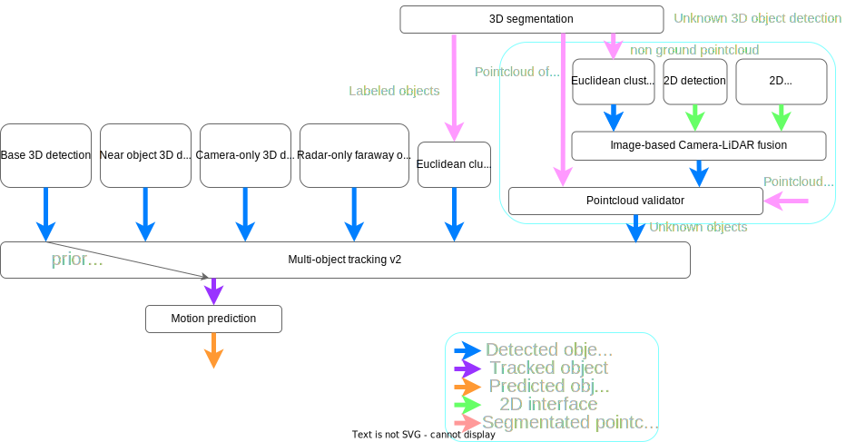
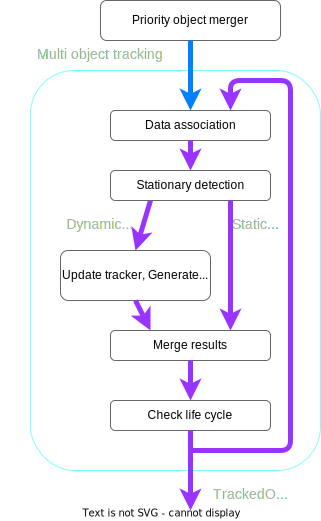
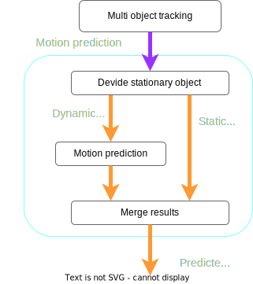

## Summary

The perception module pipeline in Autoware has grown increasingly complex due to the addition of numerous functions over time.
This complexity has made it difficult to tune many parameters and debug, especially for rule-based complicated pipelines.

This proposal aims to simplify the perception pipeline, addressing the challenges of tuning and debugging.

## Overall Pipeline for Object Recognition

### Priority Object Merger

**Priority Object Merger** introduces new features compared to the existing [object_merger](https://github.com/autowarefoundation/autoware.universe/tree/main/perception/autoware_object_merger).

Key features is following.

- **Multiple Inputs**

`Priority Object Merger` can handle multiple inputs by 1 node, reducing the need for multiple `object_merger` nodes.
It leads to be easy to debug.

- **Merge with Priority**

The existing `object_merger` uses approximate synchronization via message filters, introducing time delays.
As the amount of input data increases, which makes the delay, impacting the availability of autonomous driving.
Additionally, if some detections fail, the merger fails to combine the results, reducing availability.

The `Priority Object Merger` eliminates the message filter and uses a priority-based approach for the main detection.
When subscribing to the output of the main detection, it gathers all outputs from the detection pipeline.
If a secondary detection fails, it can still merge results from other detections, improving the system’s overall reliability and availability.

### Base 3D Detection

Autoware primarily uses ML-based methods for 3D detection, referred to as **Base 3D Detection**.
Available methods include:

- [CenterPoint](https://github.com/autowarefoundation/autoware.universe/tree/main/perception/autoware_lidar_centerpoint)
- [TransFusion-L](https://github.com/autowarefoundation/autoware.universe/tree/main/perception/autoware_lidar_transfusion)
- BEVFusion-L (TBD)

The detection range for `Base 3D Detection` typically falls between 90m and 120m, depending on the case.

If you wish to use Camera-LiDAR fusion, you can integrate models like BEVFusion-CL (Camera-LiDAR fusion model).
However, `Base 3D Detection` needs stable performance, as it is a critical component for the new architecture.
Therefore, if sensor data drops frequently, we do not recommend using Camera-LiDAR fusion methods.

### Near-Object 3D Detection

To enhance detection of nearby objects, especially pedestrians and cyclists, we have introduced **Near-Object 3D Detection**.
This can serve as a supplementary detection method alongside the `Base 3D Detection`.

We primarily use ML-based methods like CenterPoint for near-object detection, which excels at detecting small objects.
We apply higher-resolution voxel grids in the ML model to improve detection accuracy for small objects.
The detection range typically falls between 30m and 50m.

### Camera-Only 3D Detection

To improve detection of objects that LiDAR-based methods struggle with, we have introduced **Camera-Only 3D Detection**.
We apply threshold with high confidence to suppress the bad influence of false positive.

### Radar-Only Faraway Object 3D Detection

For enhanced detection of distant objects, we use **Radar-Only 3D Detection**.
For more details, see [the document on faraway radar object detection](https://github.com/autowarefoundation/autoware-documentation/blob/main/docs/design/autoware-architecture/perception/reference-implementations/radar-based-3d-detector/faraway-object-detection.md).

### Cluster-Based Camera-LiDAR Fusion 3D Detection

To improve detection of objects that LiDAR-based methods struggle to detect, we also offer **Cluster-Based Camera-LiDAR Fusion 3D Detection**.
This fusion process combines non-ground LiDAR point clouds (filtered by ground segmentation) with the results of 2D detection or semantic segmentation.
This can be used as supplementary detection alongside Base 3D Detection.

However, as the data from point clouds and images increase, the processing time also increases.
Therefore, we recommend avoiding this pipeline in situations where processing time is critical.

### 3D Semantic Segmentation

To improve detection of objects that are difficult to detect using traditional 3D detection methods, especially vegetation, we have implemented **3D Semantic Segmentation**.
It serves the non-ground pointcloud and labeled pointcloud for dynamic objects and vegetation.

To adapt with the Autoware interface, we use a clustering method for processing 3D segmentation outputs.

### Multi-Object Tracking

The **Multi-Object Tracking** algorithm is illustrated below:

The base algorithm is [multi_object_tracker](https://github.com/autowarefoundation/autoware.universe/tree/main/perception/autoware_multi_object_tracker).
As the input data volume increases, the processing time also increases.
To optimize this, we reduce computational cost by incorporating stationary object detection.

### Motion Prediction

The **Motion Prediction** algorithm is illustrated below:

Available algorithms include:

- [Map-Based Prediction](https://github.com/autowarefoundation/autoware.universe/tree/main/perception/autoware_map_based_prediction)
- MTR (TBD)
- SIMPE (TBD)

As with multi-object tracking, the processing time increases with the volume of input data.
To mitigate this, we reduce computational cost by incorporating stationary object detection.

## Development Roadmap

- [ ] Implement Priority Object Merger
- [ ] Develop a new model for Near-Object 3D Detection
- [ ] Create Camera-Only 3D Detection package
- [ ] Develop 3D Semantic Segmentation package
- [ ] Implement clustering for 3D Semantic Segmentation output
- [ ] Update perception launcher for detection integration
- [ ] Add stationary detection feature in `multi_object_tracker`
- [ ] Add stationary object skipping in Motion Prediction
