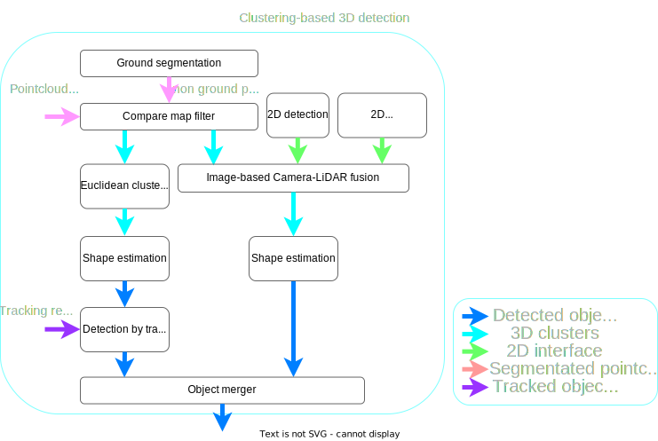

## Summary

This proposal aims to merge for [reference implementation of perception module in Autoware](https://github.com/autowarefoundation/autoware-documentation/blob/main/docs/design/autoware-architecture/perception/reference_implementation.md).

The perception module pipeline in Autoware has grown increasingly complex due to the addition of numerous functions over time.
This complexity has made it difficult to tune many parameters and debug, especially for rule-based complicated pipelines.
This proposal aims to simplify the perception pipeline, addressing the challenges of tuning and debugging.

## Overall Pipeline for Object Recognition

### Base 3D Detection

Autoware primarily uses ML-based methods for 3D detection, referred to as **Base 3D Detection**.
Available methods include:

- [CenterPoint](https://github.com/autowarefoundation/autoware.universe/tree/main/perception/autoware_lidar_centerpoint)
- [TransFusion-L](https://github.com/autowarefoundation/autoware.universe/tree/main/perception/autoware_lidar_transfusion)
- BEVFusion-L (TBD)
- [Apollo instance segmentation](https://github.com/autowarefoundation/autoware.universe/tree/main/perception/autoware_lidar_apollo_instance_segmentation) + [shape estimation](https://github.com/autowarefoundation/autoware.universe/tree/main/perception/autoware_shape_estimation)

The detection range for `Base 3D Detection` typically falls between 90m and 120m, depending on the specific case.
Note that we will delete `obstacle_pointcloud_based_validator` in new architecture because the computational cost is high and its effect is low.

If you wish to use Camera-LiDAR fusion, models like BEVFusion-CL (Camera-LiDAR fusion model) can be integrated.
However, since `Base 3D Detection` is a critical component of the new architecture, stable performance is essential.
Therefore, we do not recommend using Camera-LiDAR fusion methods in environments where sensor data frequently drops.

### Near-Object 3D Detection

As optional method for detection to enhance detection of nearby objects, especially pedestrians and cyclists, we have introduced **Near-Object 3D Detection**.
This can serve as a supplementary detection method alongside `Base 3D Detection`.

We primarily use ML-based methods like CenterPoint for near-object detection, which excels at detecting small objects.
By applying higher-resolution voxel grids in the ML model, we improve detection accuracy for small objects.
The detection range typically falls between 30m and 50m.

### Camera-Only 3D Detection

As optional method for detection to improve detection of objects that LiDAR-based methods struggle with, we have introduced **Camera-Only 3D Detection**.
`Camera-Only 3D detection` aims to solve the cases that are difficult to detect with LiDAR-based methods.
For example, `Camera-Only 3D detection` will deal with detection of objects with tree occlusion and long-distance recognition.

Note that we apply a high-confidence threshold to suppress the impact of false positives.

### Radar-Only Faraway Object 3D Detection

For enhanced detection of distant objects, we use **Radar-Only 3D Detection**.
For more details, see [the document on faraway radar object detection](https://github.com/autowarefoundation/autoware-documentation/blob/main/docs/design/autoware-architecture/perception/reference-implementations/radar-based-3d-detector/faraway-object-detection.md).

### 3D Semantic Segmentation

To improve detection of objects that are difficult to detect using traditional 3D detection methods, especially vegetation and traffic cone, we will implement **3D Semantic Segmentation**.
`3D Semantic Segmentation` provides non-ground point clouds and labeled pointcloud for some objects and vegetation.

To integrate with the Autoware interface, we use a euclidean clustering method for processing 3D segmentation outputs.

### Cluster-Based 3D Detection

To improve detection of objects that LiDAR-based methods struggle to detect, we offer **Cluster-Based 3D Detection**.
`Cluster-Based 3D Detection` consists of many nodes, and the pipeline shows as following.

`Cluster-Based 3D Detection` is based on euclidean clustering including roi based pointcloud fusion.
Its process combines non-ground LiDAR point clouds with the results of 2D detection or semantic segmentation.
This can be used as supplementary detection alongside `Base 3D Detection`.

Note that as the data from point clouds and images increase, the processing time also increases.
Therefore, we recommend avoiding this pipeline in situations where processing time is critical or use for only narrow detection range.

### Multi-Object Tracking v2

**Multi-Object Tracking v2** is based on existing [multi_object_tracker](https://github.com/autowarefoundation/autoware.universe/tree/main/perception/autoware_multi_object_tracker) and illustrated below:

Key features is following.

- **Priority Object Merger**

`Priority Object Merger` introduces new features compared to the existing [object_merger](https://github.com/autowarefoundation/autoware.universe/tree/main/perception/autoware_object_merger).
`Priority Object Merger` can handle multiple inputs, reducing the need for multiple `object_merger` nodes.
It leads to be easy to debug.

The existing `object_merger` uses approximate synchronization via message filters, introducing time delays.
As the amount of input data increases, which makes the delay, impacting the availability of autonomous driving.
Additionally, if some detections fail, the merger fails to combine the results, reducing availability.

The `Priority Object Merger` eliminates the message filter and uses a priority-based approach for the main detection.
When subscribing to the output of the main detection, it gathers all outputs from the detection pipeline.
It gathers outputs from all detections, ensuring that even if a secondary detection fails, results from other detections can still be merged, improving overall reliability and availability.

- **Stationary detection**

As input data volume increases, processing time also increases.
To optimize performance, we reduce computational cost by incorporating stationary object detection.

### Motion Prediction

The **Motion Prediction** algorithm is illustrated below:

Available algorithms include:

- [Map-Based Prediction](https://github.com/autowarefoundation/autoware.universe/tree/main/perception/autoware_map_based_prediction)
- MTR (TBD)
- SIMPE (TBD)

As with multi-object tracking, the processing time increases with input data volume.
To mitigate this, we reduce computational cost by incorporating stationary object detection.

## Development Roadmap

- [ ] Implement `multi object tracking v2`
  - Implement Priority Object Merger
  - Add stationary detection
- [ ] Develop a new model for Near-Object 3D Detection
- [ ] Create Camera-Only 3D Detection package
- [ ] Develop 3D Semantic Segmentation package
- [ ] Implement clustering method for 3D Semantic Segmentation output
- [ ] Update perception launcher for detection integration
- [ ] Add stationary object skipping in Motion Prediction
